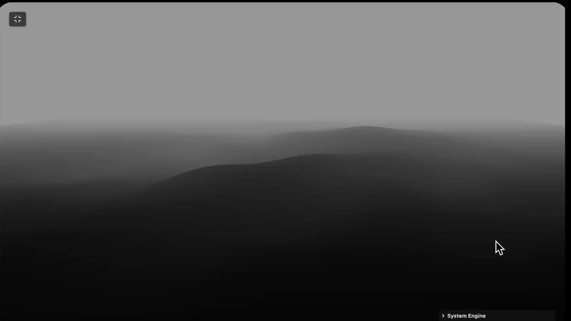
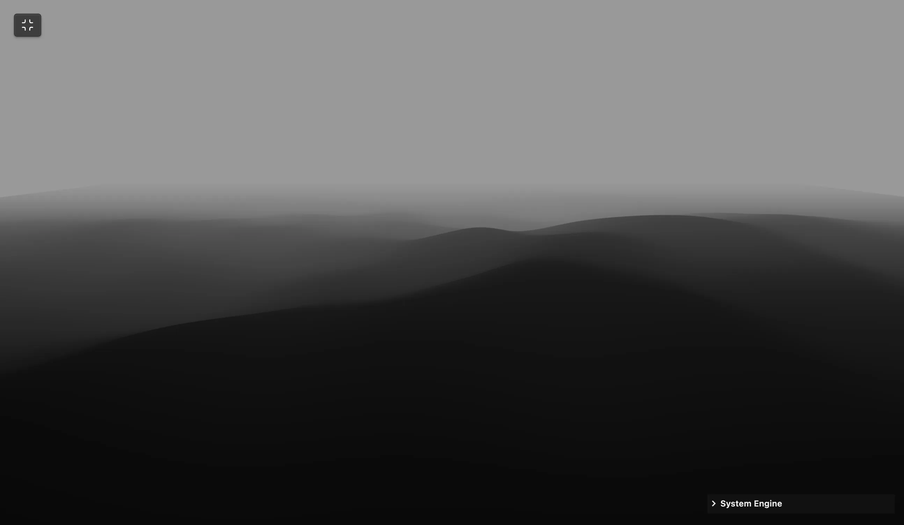

  
  
  <h1 align="center">REVERSE FLIGHT</h1>
  <h3 align="center"> Procedural WebGL Flight Simulator </h3>

  <!-- TOP PURPLE LINKS -->
  
  
  
   
  <!-- BOTTOM GOLD TAXONOMY -->
  
  
  
  

  

    <i> An interactive WebGL flight simulator over a procedural Perlin noise mountain grid using Three.js and dynamic normal computations. </i>
  

  

Welcome to **Reverse Flight**, a stunning WebGL-based flight simulation tool designed for Obsidian using Datacore. It renders an endless terrain loop using layered Perlin noise structures, offering real-time control via a floating control deck.

---

## Quick Start

To start trying Reverse Flight today:
1. **Download the Repository**: Clone or download this repository directly into any folder inside your Obsidian vault.
2. **Install Datacore**: Ensure you have the **Datacore** plugin installed and enabled in Obsidian.
3. **Open the Entry Note**: Open the **`REVERSE FLIGHT.md`** note inside Obsidian to launch the component!

---

## Features

### Endless Procedural Flight
*   **Perlin Noise Terrain**: Renders dynamic, endless flyby mountain patterns in real time using multi-octave 3D Perlin noise equations.
*   **Vignette Edge Fading**: Smoothly fades mountain elevations near the perimeter borders, ensuring seamless visual boundaries.
*   **Dynamic Normal Computations**: Computes vertex normal maps on-the-fly to react dynamically to changes in lighting parameters.

### System Engine Controls
*   **System Engine Panel**: Real-time parameter deck configured to adjust fly mode, speeds, terrain wave height, detail scales, and wireframe views.
*   **Appearance Customization**: Seamlessly adjust surface color, lighting angles, and spot intensity directly from the viewport.
*   **Camera Configuration**: Live-adjust global Field of View (FOV), height positions, and distance variables.

### Integrated Client Support
*   **Full-Tab containment**: Scales automatically to fit standard Obsidian workspace panes edge-to-edge.
*   **Dynamic Caching**: Checks local folder storage for Three.js dependencies, saving network requests and supporting offline-first loads.

---

## Directory Index & Components

The package exposes the following compiled files:

| File | Description |
| :--- | :--- |
| **[REVERSE FLIGHT.md](REVERSE%20FLIGHT.md)** | The main entry point designed to be loaded inside Obsidian canvases or workspace leaves. |
| **[src/index.jsx](src/index.jsx)** | Main bootstrapper/loader hook that mounts the full-tab immersive injector and handles view coordination. |
| **[src/App.jsx](src/App.jsx)** | Main coordinator component that handles the FullTab lifecycle, DOM reparenting, and parameter orchestration. |
| **[src/components/FlightComponent.jsx](src/components/FlightComponent.jsx)** | The core interactive WebGL landscape flight module. |
| **[src/styles/styles.jsx](src/styles/styles.jsx)** | CSS-in-JS style definition map for canvas view wrappers and controllers. |
| **[src/utils/domUtils.jsx](src/utils/domUtils.jsx)** | DOM traversal utilities to locate target workspace leaves. |
| **[src/utils/loadScript.js](src/utils/loadScript.js)** | A local robust script loading utility fetching and caching dependencies for offline performance. |
| **[METADATA.md](METADATA.md)** | Packaging manifest outlining indexing, target, and security configurations. |
| **[CONTRIBUTION.md](CONTRIBUTION.md)** | Contributor architecture standards and local compilation guidelines. |
| **[LICENSE.md](LICENSE.md)** | MIT open-source license. |

---

## Previews

| Static View | Interactive WebGL Explorer |
| :---: | :---: |
|  |  |

---

## Attribution

The visual and mathematical core of the procedural light flow and line segments geometry in this project was ported and adapted from a creative experiment originally published on [CodePen](https://codepen.io/).

---

## Contributors
- beto.group
